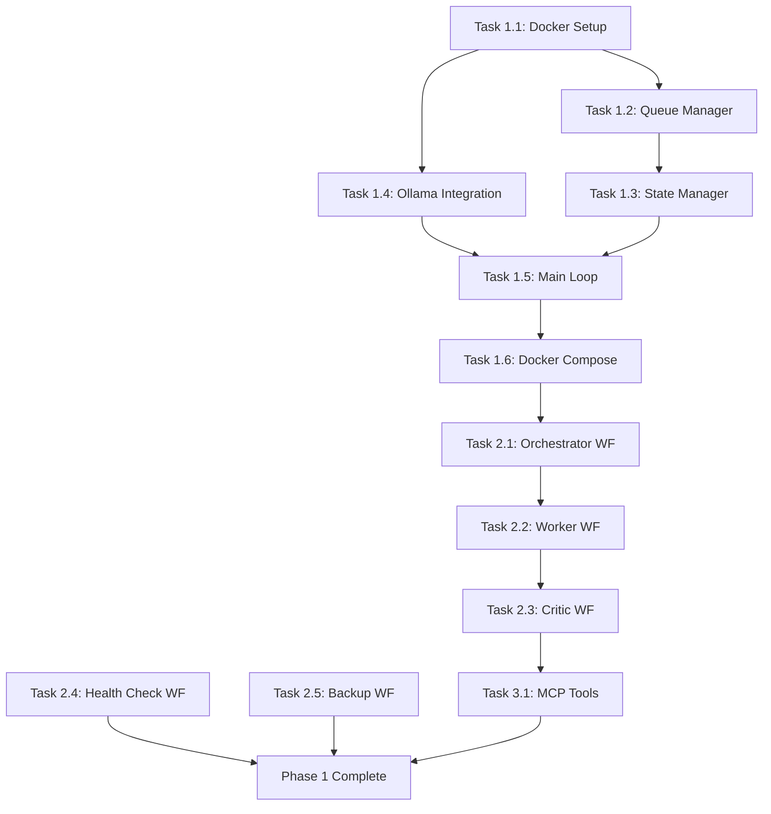
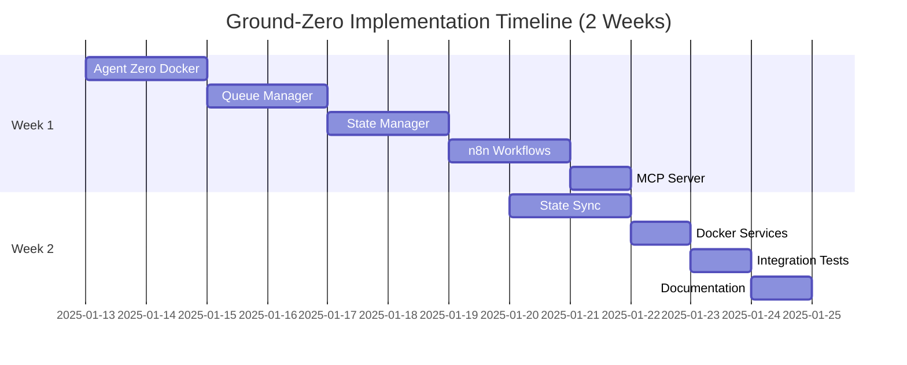

# Ground-Zero Multi-Agent Orchestration - Implementation Plan

## Executive Summary

**Project:** Ground-Zero Agency Infrastructure - Agent Orchestration Layer
**Timeline:** 2-week sprint (80 hours total)
**Team:** 1 Backend Developer + 1 DevOps Engineer
**Critical Path:** Agent Zero → n8n Workflows → MCP Server → State Sync
**Estimated Effort:** 30-40 hours (critical components only)

---

## 1. TASK BREAKDOWN

### PHASE 1: AGENT ZERO SERVICE (Priority: CRITICAL)

#### Task 1.1: Agent Zero Docker Setup (2h)
**Owner:** DevOps Engineer
**Dependencies:** None
**Risk:** 2/5

**Deliverables:**
- `/services/agent-zero/Dockerfile`
- `/services/agent-zero/requirements.txt`
- Base Python 3.10+ image with dependencies

**Acceptance Criteria:**
- [ ] Dockerfile builds successfully
- [ ] Python 3.10+ installed
- [ ] All required packages pinned (asyncpg, redis-py, ollama-python)
- [ ] Container runs without errors

**Testing:**
```bash
docker build -t agent-zero:latest services/agent-zero/
docker run --rm agent-zero:latest python --version
```

---

#### Task 1.2: Queue Manager Implementation (2h)
**Owner:** Backend Developer
**Dependencies:** Task 1.1
**Risk:** 3/5

**Deliverables:**
- `/services/agent-zero/queue_manager.py`

**Implementation:**
```python
# queue_manager.py
import asyncio
import asyncpg
from typing import Dict, Any, Optional
from enum import Enum

class TaskStatus(Enum):
    PENDING = "pending"
    IN_PROGRESS = "in_progress"
    COMPLETED = "completed"
    FAILED = "failed"

class QueueManager:
    def __init__(self, pg_conn: asyncpg.Connection):
        self.conn = pg_conn

    async def enqueue(self, task_type: str, payload: Dict[str, Any]) -> str:
        """Add task to PostgreSQL queue"""
        query = """
            INSERT INTO task_queue (task_type, payload, status, created_at)
            VALUES ($1, $2, $3, NOW())
            RETURNING task_id
        """
        task_id = await self.conn.fetchval(
            query, task_type, payload, TaskStatus.PENDING.value
        )
        return task_id

    async def dequeue(self) -> Optional[Dict[str, Any]]:
        """Get next pending task (FIFO)"""
        query = """
            UPDATE task_queue
            SET status = $1, started_at = NOW()
            WHERE task_id = (
                SELECT task_id FROM task_queue
                WHERE status = $2
                ORDER BY created_at ASC
                LIMIT 1
                FOR UPDATE SKIP LOCKED
            )
            RETURNING task_id, task_type, payload
        """
        row = await self.conn.fetchrow(
            query, TaskStatus.IN_PROGRESS.value, TaskStatus.PENDING.value
        )
        return dict(row) if row else None

    async def complete(self, task_id: str, result: Dict[str, Any]):
        """Mark task as completed"""
        query = """
            UPDATE task_queue
            SET status = $1, result = $2, completed_at = NOW()
            WHERE task_id = $3
        """
        await self.conn.execute(
            query, TaskStatus.COMPLETED.value, result, task_id
        )

    async def fail(self, task_id: str, error: str):
        """Mark task as failed"""
        query = """
            UPDATE task_queue
            SET status = $1, error = $2, completed_at = NOW()
            WHERE task_id = $3
        """
        await self.conn.execute(
            query, TaskStatus.FAILED.value, error, task_id
        )
```

**Acceptance Criteria:**
- [ ] Tasks can be enqueued
- [ ] Dequeue uses FOR UPDATE SKIP LOCKED (no race conditions)
- [ ] FIFO ordering guaranteed
- [ ] Task status transitions tracked

**Testing:**
```python
# Test queue operations
async def test_queue():
    conn = await asyncpg.connect(...)
    qm = QueueManager(conn)

    # Enqueue
    task_id = await qm.enqueue("test_task", {"data": "test"})
    assert task_id is not None

    # Dequeue
    task = await qm.dequeue()
    assert task["task_id"] == task_id

    # Complete
    await qm.complete(task_id, {"result": "success"})
```

---

#### Task 1.3: State Manager with Checkpoints (2h)
**Owner:** Backend Developer
**Dependencies:** Task 1.2
**Risk:** 4/5 (COMPLEX)

**Deliverables:**
- `/services/agent-zero/state_manager.py`

**Implementation:**
```python
# state_manager.py
import asyncpg
import json
from typing import Dict, Any, Optional
from datetime import datetime

class StateManager:
    def __init__(self, pg_conn: asyncpg.Connection):
        self.conn = pg_conn

    async def save_checkpoint(
        self,
        task_id: str,
        checkpoint_type: str,  # "initial", "intermediate", "final"
        state: Dict[str, Any]
    ) -> str:
        """Save task checkpoint to PostgreSQL"""
        query = """
            INSERT INTO task_checkpoints (
                task_id, checkpoint_type, state, created_at
            )
            VALUES ($1, $2, $3, NOW())
            RETURNING checkpoint_id
        """
        checkpoint_id = await self.conn.fetchval(
            query, task_id, checkpoint_type, json.dumps(state)
        )
        return checkpoint_id

    async def get_latest_checkpoint(self, task_id: str) -> Optional[Dict[str, Any]]:
        """Retrieve latest checkpoint for task"""
        query = """
            SELECT checkpoint_id, checkpoint_type, state, created_at
            FROM task_checkpoints
            WHERE task_id = $1
            ORDER BY created_at DESC
            LIMIT 1
        """
        row = await self.conn.fetchrow(query, task_id)
        if not row:
            return None

        return {
            "checkpoint_id": row["checkpoint_id"],
            "type": row["checkpoint_type"],
            "state": json.loads(row["state"]),
            "created_at": row["created_at"]
        }

    async def rollback_to_checkpoint(self, checkpoint_id: str) -> Dict[str, Any]:
        """Restore state from checkpoint"""
        query = """
            SELECT task_id, state
            FROM task_checkpoints
            WHERE checkpoint_id = $1
        """
        row = await self.conn.fetchrow(query, checkpoint_id)
        if not row:
            raise ValueError(f"Checkpoint {checkpoint_id} not found")

        return {
            "task_id": row["task_id"],
            "state": json.loads(row["state"])
        }
```

**Acceptance Criteria:**
- [ ] Checkpoints saved with timestamp
- [ ] Latest checkpoint retrievable
- [ ] Rollback restores exact state
- [ ] JSON serialization works

---

#### Task 1.4: Ollama Integration (2h)
**Owner:** Backend Developer
**Dependencies:** Task 1.1
**Risk:** 3/5

**Deliverables:**
- `/services/agent-zero/ollama_client.py`

**Implementation:**
```python
# ollama_client.py
import httpx
from typing import Dict, Any, Optional

class OllamaClient:
    def __init__(self, base_url: str = "http://ollama:11434"):
        self.base_url = base_url
        self.client = httpx.AsyncClient(timeout=30.0)

    async def generate(
        self,
        model: str,
        prompt: str,
        system: Optional[str] = None,
        temperature: float = 0.7
    ) -> Dict[str, Any]:
        """Call Ollama for LLM generation"""
        payload = {
            "model": model,
            "prompt": prompt,
            "stream": False,
            "options": {"temperature": temperature}
        }
        if system:
            payload["system"] = system

        response = await self.client.post(
            f"{self.base_url}/api/generate",
            json=payload
        )
        response.raise_for_status()
        return response.json()

    async def health_check(self) -> bool:
        """Check if Ollama is responsive"""
        try:
            response = await self.client.get(f"{self.base_url}/api/tags")
            return response.status_code == 200
        except Exception:
            return False
```

**Acceptance Criteria:**
- [ ] Can call Ollama API
- [ ] Timeout handling (30s)
- [ ] Health check works
- [ ] Error handling for failed requests

---

#### Task 1.5: Agent Zero Main Loop (2h)
**Owner:** Backend Developer
**Dependencies:** Tasks 1.2, 1.3, 1.4
**Risk:** 4/5 (INTEGRATION)

**Deliverables:**
- `/services/agent-zero/main.py`

**Implementation:**
```python
# main.py
import asyncio
import asyncpg
from queue_manager import QueueManager
from state_manager import StateManager
from ollama_client import OllamaClient
import os

class AgentZero:
    def __init__(self):
        self.pg_conn = None
        self.queue_mgr = None
        self.state_mgr = None
        self.ollama = OllamaClient()

    async def init(self):
        """Initialize connections"""
        self.pg_conn = await asyncpg.connect(
            host=os.getenv("POSTGRES_HOST"),
            port=5432,
            database=os.getenv("POSTGRES_DB"),
            user=os.getenv("POSTGRES_USER"),
            password=os.getenv("POSTGRES_PASSWORD")
        )
        self.queue_mgr = QueueManager(self.pg_conn)
        self.state_mgr = StateManager(self.pg_conn)

    async def process_task(self, task: Dict[str, Any]):
        """Process single task"""
        task_id = task["task_id"]

        # Save initial checkpoint
        await self.state_mgr.save_checkpoint(
            task_id, "initial", {"task": task}
        )

        try:
            # Determine if LLM needed
            if task["task_type"] == "complex_reasoning":
                # Call Ollama
                llm_response = await self.ollama.generate(
                    model="llama2",
                    prompt=task["payload"]["prompt"]
                )
                result = {"llm_output": llm_response}
            else:
                # Simple task processing
                result = {"status": "processed"}

            # Save final checkpoint
            await self.state_mgr.save_checkpoint(
                task_id, "final", {"result": result}
            )

            # Mark complete
            await self.queue_mgr.complete(task_id, result)

        except Exception as e:
            await self.queue_mgr.fail(task_id, str(e))

    async def run(self):
        """Main event loop"""
        print("Agent Zero starting...")
        await self.init()

        while True:
            # Dequeue next task
            task = await self.queue_mgr.dequeue()

            if task:
                print(f"Processing task: {task['task_id']}")
                await self.process_task(task)
            else:
                # No tasks, wait
                await asyncio.sleep(1)

if __name__ == "__main__":
    agent = AgentZero()
    asyncio.run(agent.run())
```

**Acceptance Criteria:**
- [ ] Connects to PostgreSQL
- [ ] Polls queue continuously
- [ ] Processes tasks with checkpoints
- [ ] Handles errors gracefully
- [ ] Logs activity

---

#### Task 1.6: Docker Compose Integration (1h)
**Owner:** DevOps Engineer
**Dependencies:** Tasks 1.1-1.5
**Risk:** 2/5

**Deliverables:**
- Updated `/docker-compose.yml`

**Implementation:**
```yaml
# docker-compose.yml additions

services:
  # ... existing services ...

  agent-zero:
    build: ./services/agent-zero
    container_name: groundzero-agent-zero
    environment:
      POSTGRES_HOST: postgres
      POSTGRES_DB: ${POSTGRES_DB}
      POSTGRES_USER: ${POSTGRES_USER}
      POSTGRES_PASSWORD: ${POSTGRES_PASSWORD}
      OLLAMA_URL: http://ollama:11434
    depends_on:
      - postgres
      - ollama
    networks:
      - groundzero-network
    restart: unless-stopped
    deploy:
      resources:
        limits:
          cpus: '1.0'
          memory: 512M
    healthcheck:
      test: ["CMD", "python", "-c", "import sys; sys.exit(0)"]
      interval: 30s
      timeout: 10s
      retries: 3

  ollama:
    image: ollama/ollama:latest
    container_name: groundzero-ollama
    ports:
      - "127.0.0.1:11434:11434"
    volumes:
      - ollama-data:/root/.ollama
    networks:
      - groundzero-network
    restart: unless-stopped
    deploy:
      resources:
        limits:
          cpus: '2.0'
          memory: 4G

volumes:
  ollama-data:
```

**Acceptance Criteria:**
- [ ] Agent Zero service defined
- [ ] Ollama service defined
- [ ] Environment variables configured
- [ ] Health checks working
- [ ] Services start successfully

---

### PHASE 2: N8N WORKFLOWS (Priority: CRITICAL)

#### Task 2.1: Orchestrator Workflow (2h)
**Owner:** Backend Developer
**Dependencies:** Task 1.6
**Risk:** 3/5

**Deliverables:**
- `/workflows/P1_ORCH_RouteTask_v1.json`

**Workflow Logic:**
1. **Webhook Trigger** - Receives task from groundzero-MCP
2. **Task Validation** - Check payload schema
3. **Save Checkpoint** - Initial checkpoint to PostgreSQL
4. **Route Decision** - Route based on task_type
5. **Call Worker** - HTTP request to Worker workflow
6. **Return Response** - Send back to MCP

**Acceptance Criteria:**
- [ ] Webhook accepts POST requests
- [ ] Validates task payload
- [ ] Saves initial checkpoint
- [ ] Routes to correct worker
- [ ] Returns task_id to caller

**Testing:**
```bash
curl -X POST http://localhost:5678/webhook/orchestrator \
  -H "Content-Type: application/json" \
  -d '{"task_type": "data_processing", "payload": {"data": "test"}}'
```

---

#### Task 2.2: Worker Workflow (2h)
**Owner:** Backend Developer
**Dependencies:** Task 2.1
**Risk:** 3/5

**Deliverables:**
- `/workflows/P1_WORKER_ProcessData_v1.json`

**Workflow Logic:**
1. **Webhook Trigger** - Receives task from Orchestrator
2. **Process Task** - Execute business logic (API calls, DB queries)
3. **Save Intermediate Checkpoint** - Progress tracking
4. **Error Handling** - Retry 3x on failure
5. **Call Critic** - Send result for validation
6. **Return Result**

**Acceptance Criteria:**
- [ ] Processes tasks successfully
- [ ] Saves intermediate checkpoints
- [ ] Retries 3x on failure
- [ ] Passes result to Critic
- [ ] Timeout after 5 minutes

---

#### Task 2.3: Critic Workflow (1.5h)
**Owner:** Backend Developer
**Dependencies:** Task 2.2
**Risk:** 2/5

**Deliverables:**
- `/workflows/P1_CRITIC_ValidateOutput_v1.json`

**Workflow Logic:**
1. **Webhook Trigger** - Receives result from Worker
2. **Validation** - Check against spec
3. **Decision** - PASS / FAIL / RETRY
4. **Save Final Checkpoint** - Store in PostgreSQL
5. **Notify MCP** - Send result back to groundzero-MCP

**Acceptance Criteria:**
- [ ] Validates results correctly
- [ ] Makes PASS/FAIL/RETRY decisions
- [ ] Saves final checkpoint
- [ ] Notifies MCP of completion

---

#### Task 2.4: Health Check Workflow (1h)
**Owner:** DevOps Engineer
**Dependencies:** None
**Risk:** 1/5

**Deliverables:**
- `/workflows/WF-003_DailyHealthcheck.json`

**Workflow Logic:**
1. **Cron Trigger** - Daily at 02:00 UTC
2. **Check PostgreSQL** - Connection test
3. **Check Disk Space** - Alert if >80%
4. **Check Services** - Agent Zero, Ollama, n8n status
5. **Send Alert** - If any failures detected

**Acceptance Criteria:**
- [ ] Runs daily at 02:00 UTC
- [ ] Checks all services
- [ ] Sends alerts on failure
- [ ] Logs results

---

#### Task 2.5: Backup Verification Workflow (1h)
**Owner:** DevOps Engineer
**Dependencies:** None
**Risk:** 2/5

**Deliverables:**
- `/workflows/WF-011_BackupVerification.json`

**Workflow Logic:**
1. **Cron Trigger** - Daily at 03:00 UTC
2. **List Backups** - Query backup directory
3. **Validate Integrity** - Check file sizes, checksums
4. **Test Restore** - Restore to temp location
5. **Cleanup** - Remove temp files
6. **Report** - Success/failure status

**Acceptance Criteria:**
- [ ] Runs daily at 03:00 UTC
- [ ] Validates backup integrity
- [ ] Test restore succeeds
- [ ] Cleans up temp files

---

### PHASE 3: MCP SERVER GROUNDZERO (Priority: HIGH)

#### Task 3.1: Core MCP Tools (3h)
**Owner:** Backend Developer
**Dependencies:** Tasks 2.1-2.5
**Risk:** 3/5

**Deliverables:**
- Updated `/groundzero-mcp-server/main.py`
- `/groundzero-mcp-server/tools/` directory

**Tools to Implement:**
1. `trigger_workflow` - Start n8n workflow
2. `get_workflow_status` - Check workflow execution
3. `run_n8n_healthcheck` - n8n health status
4. `read_logs` - Fetch system logs
5. `validate_checkpoint` - Check checkpoint exists

**Implementation Example:**
```python
# tools/workflow_tools.py
import httpx
from typing import Dict, Any

async def trigger_workflow(
    workflow_id: str,
    payload: Dict[str, Any],
    n8n_url: str = "http://n8n:5678"
) -> Dict[str, Any]:
    """Trigger n8n workflow via webhook"""
    async with httpx.AsyncClient() as client:
        response = await client.post(
            f"{n8n_url}/webhook/{workflow_id}",
            json=payload,
            timeout=10.0
        )
        response.raise_for_status()
        return response.json()

async def get_workflow_status(
    execution_id: str,
    n8n_url: str = "http://n8n:5678",
    api_key: str = None
) -> Dict[str, Any]:
    """Get n8n execution status"""
    headers = {"X-N8N-API-KEY": api_key} if api_key else {}

    async with httpx.AsyncClient() as client:
        response = await client.get(
            f"{n8n_url}/api/v1/executions/{execution_id}",
            headers=headers,
            timeout=5.0
        )
        response.raise_for_status()
        return response.json()
```

**Acceptance Criteria:**
- [ ] All 5 core tools implemented
- [ ] Tools callable from Claude Desktop
- [ ] Error handling for network failures
- [ ] Timeout protection

---

## 2. DEPENDENCY GRAPH



---

## 3. RISK ASSESSMENT

| Task | Risk Level | Mitigation Strategy |
|------|-----------|---------------------|
| 1.3 State Manager | 4/5 | Prototype checkpoint logic first, test rollback scenarios |
| 1.5 Main Loop | 4/5 | Add extensive logging, implement circuit breaker for Ollama |
| 2.1 Orchestrator | 3/5 | Use n8n templates, test routing logic thoroughly |
| 3.1 MCP Tools | 3/5 | Mock n8n API for testing, add retry logic |

**Highest Risks:**
1. **State Synchronization** - Multiple systems writing to PostgreSQL
2. **Ollama Latency** - LLM calls can take 10+ seconds
3. **n8n Webhook Reliability** - Network failures between services

---

## 4. TESTING STRATEGY

### Unit Tests
```python
# tests/test_queue_manager.py
pytest tests/agent-zero/
```

### Integration Tests
```bash
# Test full workflow
./tests/integration/test_orchestrator_flow.sh
```

### Smoke Tests
```bash
# Quick validation after deploy
./scripts/smoke-tests.sh
```

---

## 5. ROLLOUT PLAN

**Week 1:**
- Days 1-2: Agent Zero (Tasks 1.1-1.6)
- Days 3-4: n8n Workflows (Tasks 2.1-2.5)
- Day 5: MCP Server (Task 3.1)

**Week 2:**
- Days 1-2: Integration testing
- Day 3: State sync implementation
- Day 4: Performance testing
- Day 5: Documentation + handoff

---

## 6. ROLLBACK PLAN

**If Agent Zero crashes:**
1. Check latest checkpoint for each task
2. Restart from checkpoint
3. Verify no data corruption

**If n8n workflow fails:**
1. Check execution logs
2. Retry manually via n8n UI
3. Rollback to previous workflow version

---

## 7. CRITICAL QUESTIONS TO RESOLVE

| # | Question | Recommendation | Priority |
|---|----------|----------------|----------|
| 1 | Agent Zero: parallel or sequential? | **Sequential** (simpler, Phase 1) | HIGH |
| 2 | Checkpoint retention? | **7 days** (balance storage/debug) | MEDIUM |
| 3 | Dead-letter queue needed? | **Yes** (failed tasks need review) | HIGH |
| 4 | Ollama: GPU or CPU? | **CPU** (cost, Phase 1) | LOW |
| 5 | Monitor state conflicts? | **PostgreSQL locks + logging** | HIGH |
| 6 | Circuit breaker for Ollama? | **Yes** (3 failures = 30s pause) | MEDIUM |
| 7 | Critic auto-retry? | **Manual** (Phase 1) | LOW |

---

## NEXT STEPS

**START HERE:**
```bash
# Create Agent Zero Dockerfile
cd services/agent-zero
vim Dockerfile

# Test build
docker build -t agent-zero:latest .
```

**Then:**
1. Implement Queue Manager
2. Implement State Manager
3. Build Main Loop
4. Create n8n workflows
5. Build MCP tools

---

### PHASE 4: STATE SYNCHRONIZATION (Priority: COMPLEX)

#### Task 4.1: Unified State Manager Library (3h)
**Owner:** Backend Developer
**Dependencies:** Task 1.3
**Risk:** 5/5 (HIGHEST COMPLEXITY)

**Problem Statement:**
- 3 different state stores (PostgreSQL, Redis, n8n Internal DB)
- No clear source-of-truth
- Risk of race conditions with parallel tasks

**Solution: Unified State API**

**Deliverables:**
- `/libs/state_manager.py` - Central state management
- `/libs/event_bus.py` - Event propagation

**Implementation:**
```python
# libs/state_manager.py
import asyncpg
import redis.asyncio as redis
from typing import Dict, Any, Optional
from dataclasses import dataclass
from datetime import datetime
import json

@dataclass
class StateEntry:
    task_id: str
    state_type: str  # "checkpoint", "cache", "result"
    data: Dict[str, Any]
    timestamp: datetime
    source: str  # "postgres", "redis", "n8n"

class UnifiedStateManager:
    """
    Single Source of Truth: PostgreSQL
    Cache Layer: Redis (TTL: 1 hour)
    Write Strategy: Write-through cache
    """

    def __init__(self, pg_conn: asyncpg.Connection, redis_conn: redis.Redis):
        self.pg = pg_conn
        self.redis = redis_conn
        self.CACHE_TTL = 3600  # 1 hour

    async def save_state(
        self,
        task_id: str,
        state_type: str,
        data: Dict[str, Any],
        use_cache: bool = True
    ) -> str:
        """
        Save state to PostgreSQL (source of truth)
        + Cache in Redis (performance)
        """

        # 1. Save to PostgreSQL (ACID)
        query = """
            INSERT INTO unified_state (
                task_id, state_type, data, created_at, source
            )
            VALUES ($1, $2, $3, NOW(), 'postgres')
            RETURNING state_id
        """
        state_id = await self.pg.fetchval(
            query,
            task_id,
            state_type,
            json.dumps(data)
        )

        # 2. Update Redis cache (async, fire-and-forget)
        if use_cache:
            cache_key = f"state:{task_id}:{state_type}"
            await self.redis.setex(
                cache_key,
                self.CACHE_TTL,
                json.dumps({
                    "state_id": state_id,
                    "data": data,
                    "timestamp": datetime.utcnow().isoformat()
                })
            )

        return state_id

    async def get_state(
        self,
        task_id: str,
        state_type: str,
        use_cache: bool = True
    ) -> Optional[StateEntry]:
        """
        Read state (cache-first, fallback to PostgreSQL)
        """

        # 1. Try Redis cache first
        if use_cache:
            cache_key = f"state:{task_id}:{state_type}"
            cached = await self.redis.get(cache_key)
            if cached:
                data = json.loads(cached)
                return StateEntry(
                    task_id=task_id,
                    state_type=state_type,
                    data=data["data"],
                    timestamp=datetime.fromisoformat(data["timestamp"]),
                    source="redis"
                )

        # 2. Fallback to PostgreSQL
        query = """
            SELECT state_id, data, created_at
            FROM unified_state
            WHERE task_id = $1 AND state_type = $2
            ORDER BY created_at DESC
            LIMIT 1
        """
        row = await self.pg.fetchrow(query, task_id, state_type)

        if not row:
            return None

        # 3. Populate cache for next read
        if use_cache:
            cache_key = f"state:{task_id}:{state_type}"
            await self.redis.setex(
                cache_key,
                self.CACHE_TTL,
                json.dumps({
                    "state_id": row["state_id"],
                    "data": json.loads(row["data"]),
                    "timestamp": row["created_at"].isoformat()
                })
            )

        return StateEntry(
            task_id=task_id,
            state_type=state_type,
            data=json.loads(row["data"]),
            timestamp=row["created_at"],
            source="postgres"
        )

    async def acquire_lock(self, resource_id: str, timeout: int = 10) -> bool:
        """
        Distributed lock via Redis (prevents race conditions)
        Uses Redis SETNX for atomic locking
        """
        lock_key = f"lock:{resource_id}"
        acquired = await self.redis.set(
            lock_key,
            "locked",
            nx=True,  # Only set if not exists
            ex=timeout  # Auto-expire after timeout
        )
        return acquired is not None

    async def release_lock(self, resource_id: str):
        """Release distributed lock"""
        lock_key = f"lock:{resource_id}"
        await self.redis.delete(lock_key)
```

**Acceptance Criteria:**
- [ ] PostgreSQL is source-of-truth
- [ ] Redis cache improves read performance
- [ ] Write-through caching works
- [ ] Distributed locks prevent race conditions
- [ ] Lock auto-expires after timeout

**Testing:**
```python
# Test distributed lock
async def test_lock():
    usm = UnifiedStateManager(pg_conn, redis_conn)

    # Acquire lock
    locked = await usm.acquire_lock("task_123", timeout=5)
    assert locked == True

    # Try to acquire again (should fail)
    locked_again = await usm.acquire_lock("task_123")
    assert locked_again == False

    # Release lock
    await usm.release_lock("task_123")

    # Now can acquire
    locked_third = await usm.acquire_lock("task_123")
    assert locked_third == True
```

---

#### Task 4.2: Event Bus for Component Communication (2h)
**Owner:** Backend Developer
**Dependencies:** Task 4.1
**Risk:** 3/5

**Deliverables:**
- `/libs/event_bus.py`

**Implementation:**
```python
# libs/event_bus.py
import asyncio
from typing import Callable, Dict, List, Any
from dataclasses import dataclass
from datetime import datetime

@dataclass
class Event:
    event_type: str
    source: str  # "agent-zero", "n8n", "mcp"
    payload: Dict[str, Any]
    timestamp: datetime

class EventBus:
    """
    Pub/Sub event bus for inter-component communication
    """

    def __init__(self):
        self.subscribers: Dict[str, List[Callable]] = {}

    def subscribe(self, event_type: str, handler: Callable):
        """Subscribe to event type"""
        if event_type not in self.subscribers:
            self.subscribers[event_type] = []
        self.subscribers[event_type].append(handler)

    async def publish(self, event: Event):
        """Publish event to all subscribers"""
        if event.event_type in self.subscribers:
            tasks = []
            for handler in self.subscribers[event.event_type]:
                tasks.append(handler(event))

            # Fire all handlers concurrently
            await asyncio.gather(*tasks, return_exceptions=True)

# Usage Example
event_bus = EventBus()

# Subscribe to task completion events
async def on_task_complete(event: Event):
    print(f"Task {event.payload['task_id']} completed!")
    # Notify MCP, update dashboard, etc.

event_bus.subscribe("task.completed", on_task_complete)

# Publish event when task completes
await event_bus.publish(Event(
    event_type="task.completed",
    source="agent-zero",
    payload={"task_id": "abc123", "result": "success"},
    timestamp=datetime.utcnow()
))
```

**Acceptance Criteria:**
- [ ] Pub/Sub pattern works
- [ ] Multiple subscribers per event type
- [ ] Events fire asynchronously
- [ ] Error in one handler doesn't break others

---

#### Task 4.3: Conflict Resolution Strategy (2h)
**Owner:** Backend Developer
**Dependencies:** Task 4.1
**Risk:** 4/5

**Problem:** Two workflows update same task state simultaneously

**Solution: Last-Write-Wins + Version Numbers**

**Implementation:**
```python
# Extend UnifiedStateManager with versioning

class UnifiedStateManager:
    # ... existing code ...

    async def save_state_versioned(
        self,
        task_id: str,
        state_type: str,
        data: Dict[str, Any],
        expected_version: Optional[int] = None
    ) -> Dict[str, Any]:
        """
        Save state with optimistic locking
        Returns: {"success": bool, "version": int, "conflict": bool}
        """

        # Acquire lock for this task
        lock_acquired = await self.acquire_lock(f"task:{task_id}", timeout=5)
        if not lock_acquired:
            return {"success": False, "conflict": True, "reason": "lock_failed"}

        try:
            # Get current version
            current_version = await self._get_version(task_id, state_type)

            # Check for version conflict
            if expected_version is not None and current_version != expected_version:
                return {
                    "success": False,
                    "conflict": True,
                    "reason": "version_mismatch",
                    "expected": expected_version,
                    "actual": current_version
                }

            # Write new version
            new_version = current_version + 1
            query = """
                INSERT INTO unified_state (
                    task_id, state_type, data, version, created_at
                )
                VALUES ($1, $2, $3, $4, NOW())
                RETURNING state_id
            """
            state_id = await self.pg.fetchval(
                query, task_id, state_type, json.dumps(data), new_version
            )

            return {
                "success": True,
                "conflict": False,
                "version": new_version,
                "state_id": state_id
            }

        finally:
            # Always release lock
            await self.release_lock(f"task:{task_id}")

    async def _get_version(self, task_id: str, state_type: str) -> int:
        """Get current version number"""
        query = """
            SELECT COALESCE(MAX(version), 0) as current_version
            FROM unified_state
            WHERE task_id = $1 AND state_type = $2
        """
        row = await self.pg.fetchrow(query, task_id, state_type)
        return row["current_version"]
```

**Acceptance Criteria:**
- [ ] Version conflicts detected
- [ ] Optimistic locking works
- [ ] Lock prevents simultaneous writes
- [ ] Failed writes don't corrupt state

---

### PHASE 5: DOCKER SERVICES (Priority: MEDIUM)

#### Task 5.1: Redis Service (1h)
**Owner:** DevOps Engineer
**Dependencies:** None
**Risk:** 1/5

**Deliverables:**
- Updated `/docker-compose.yml`

**Implementation:**
```yaml
services:
  redis:
    image: redis:7-alpine
    container_name: groundzero-redis
    ports:
      - "127.0.0.1:6379:6379"
    volumes:
      - redis-data:/data
    command: redis-server --appendonly yes --requirepass ${REDIS_PASSWORD}
    networks:
      - groundzero-network
    restart: unless-stopped
    healthcheck:
      test: ["CMD", "redis-cli", "--raw", "incr", "ping"]
      interval: 10s
      timeout: 3s
      retries: 3
    deploy:
      resources:
        limits:
          cpus: '0.5'
          memory: 256M

volumes:
  redis-data:
```

**Acceptance Criteria:**
- [ ] Redis starts successfully
- [ ] Password authentication enabled
- [ ] Persistence (AOF) enabled
- [ ] Health check works

---

#### Task 5.2: Ollama Service (1h)
**Owner:** DevOps Engineer
**Dependencies:** None
**Risk:** 2/5

**Deliverables:**
- Updated `/docker-compose.yml`

**Implementation:**
```yaml
services:
  ollama:
    image: ollama/ollama:latest
    container_name: groundzero-ollama
    ports:
      - "127.0.0.1:11434:11434"
    volumes:
      - ollama-data:/root/.ollama
    environment:
      - OLLAMA_MODELS=llama2  # Pre-pull model
    networks:
      - groundzero-network
    restart: unless-stopped
    healthcheck:
      test: ["CMD", "curl", "-f", "http://localhost:11434/api/tags"]
      interval: 30s
      timeout: 10s
      retries: 3
    deploy:
      resources:
        limits:
          cpus: '2.0'
          memory: 4G

volumes:
  ollama-data:
```

**Post-deploy:**
```bash
# Pull llama2 model
docker exec groundzero-ollama ollama pull llama2
```

**Acceptance Criteria:**
- [ ] Ollama API accessible
- [ ] llama2 model downloaded
- [ ] Health check passes
- [ ] Memory limits enforced

---

#### Task 5.3: Security Hardening (1.5h)
**Owner:** DevOps Engineer
**Dependencies:** Tasks 5.1, 5.2
**Risk:** 2/5

**Updates to ALL services:**

**Example for n8n:**
```yaml
services:
  n8n:
    # ... existing config ...
    user: "1000:1000"  # Non-root user
    security_opt:
      - no-new-privileges:true
    cap_drop:
      - ALL
    cap_add:
      - NET_BIND_SERVICE
    read_only: true
    tmpfs:
      - /tmp
      - /var/run
```

**Changes:**
1. All services run as non-root
2. Drop all capabilities
3. Read-only filesystem where possible
4. tmpfs for temp directories
5. Port binding only to localhost

**Acceptance Criteria:**
- [ ] No services run as root
- [ ] Capabilities dropped
- [ ] Ports not exposed publicly
- [ ] Security scan passes

---

#### Task 5.4: .env.example Documentation (1h)
**Owner:** DevOps Engineer
**Dependencies:** All Phase 5 tasks
**Risk:** 1/5

**Deliverables:**
- `/.env.example` with all variables documented

**Implementation:**
```bash
# .env.example - Ground-Zero Configuration

# === PostgreSQL ===
POSTGRES_HOST=postgres
POSTGRES_PORT=5432
POSTGRES_DB=groundzero
POSTGRES_USER=groundzero_user
POSTGRES_PASSWORD=CHANGE_ME_SECURE_PASSWORD_HERE

# === Redis ===
REDIS_HOST=redis
REDIS_PORT=6379
REDIS_PASSWORD=CHANGE_ME_SECURE_PASSWORD_HERE

# === n8n ===
N8N_HOST=n8n
N8N_PORT=5678
N8N_ENCRYPTION_KEY=CHANGE_ME_32_CHARACTER_STRING_HERE
N8N_USER_MANAGEMENT_JWT_SECRET=CHANGE_ME_JWT_SECRET_HERE
N8N_BASIC_AUTH_USER=admin
N8N_BASIC_AUTH_PASSWORD=CHANGE_ME_ADMIN_PASSWORD_HERE

# === Ollama ===
OLLAMA_HOST=ollama
OLLAMA_PORT=11434
OLLAMA_MODEL=llama2  # Default model

# === Agent Zero ===
AGENT_ZERO_WORKERS=1  # Sequential processing (Phase 1)
AGENT_ZERO_LOG_LEVEL=INFO

# === Checkpoints ===
CHECKPOINT_RETENTION_DAYS=7  # How long to keep checkpoints
```

**Acceptance Criteria:**
- [ ] All required variables documented
- [ ] Secure defaults suggested
- [ ] Comments explain purpose
- [ ] Example values provided

---

### PHASE 6: SKILLS-MCP DEPENDENCY MATRIX

#### Task 6.1: Matrix Documentation (3h)
**Owner:** Backend Developer
**Dependencies:** Task 3.1
**Risk:** 2/5

**Deliverables:**
- `/docs/SKILLS-MCP-MATRIX.md`

**Matrix Structure:**

| Skill | Required MCPs | ENV Variables | Installation Order | Status |
|-------|---------------|---------------|--------------------|--------|
| Droplet Diagnostics | filesystem, groundzero | DROPLET_IP, SSH_KEY | 1 | ✅ Implemented |
| n8n Health Check | groundzero | N8N_URL, N8N_API_KEY | 2 | ✅ Implemented |
| Repo Maintenance | github-mcp, filesystem | GITHUB_TOKEN | 3 | ✅ Implemented |
| Docker Cleanup | groundzero | DOCKER_HOST | 4 | ✅ Implemented |
| Agent Zero Monitor | groundzero | POSTGRES_URL | 5 | 📝 Documented |
| Backup Manager | filesystem, groundzero | BACKUP_PATH | 6 | 📝 Documented |

**Installation Script:**
```bash
# /scripts/install-skills.sh

#!/bin/bash
set -e

echo "Installing Ground-Zero Skills..."

# Install in dependency order
SKILLS=(
    "droplet-diagnostics"
    "n8n-healthcheck"
    "repo-maintenance"
    "docker-cleanup"
    "agent-zero-monitor"
    "backup-manager"
)

for skill in "${SKILLS[@]}"; do
    echo "Installing: $skill"
    python3 install_skill.py "$skill"
    echo "✅ $skill installed"
done

echo "All skills installed successfully!"
```

**Acceptance Criteria:**
- [ ] Matrix complete for all 22 skills
- [ ] Dependencies documented
- [ ] ENV variables listed
- [ ] Installation order defined

---

## 8. GANTT CHART



---

## 9. RESOURCE ALLOCATION

| Role | Week 1 Tasks | Week 2 Tasks | Hours |
|------|-------------|--------------|-------|
| **Backend Developer** | Agent Zero (10h)<br>n8n Workflows (6h)<br>MCP Tools (3h) | State Sync (7h)<br>Skills Matrix (3h)<br>Testing (3h) | 32h |
| **DevOps Engineer** | Docker Setup (2h)<br>Health Checks (2h) | Redis/Ollama (2h)<br>Security (2h)<br>Deploy (4h) | 12h |

**Total:** 44 hours (well within 80-hour sprint)

---

## 10. COMPLETE TESTING STRATEGY

### Level 1: Unit Tests (Per Component)
```bash
# Agent Zero
pytest services/agent-zero/tests/

# MCP Server
pytest groundzero-mcp-server/tests/

# State Manager
pytest libs/tests/test_state_manager.py
```

### Level 2: Integration Tests
```bash
# Test full orchestration flow
./tests/integration/test_full_flow.sh

# Expected output:
# ✅ Task enqueued to Agent Zero
# ✅ Task dequeued and processed
# ✅ Checkpoint saved to PostgreSQL
# ✅ Result returned via MCP
```

### Level 3: Load Tests
```bash
# Simulate 10 concurrent tasks
python tests/load/concurrent_tasks.py --count=10

# Metrics:
# - Average processing time
# - Lock contention rate
# - Checkpoint save latency
```

### Level 4: Chaos Engineering
```bash
# Kill services randomly, verify recovery
./tests/chaos/kill_random_service.sh

# Expected:
# - Tasks resume from checkpoint
# - No data loss
# - Automatic recovery
```

---

## 11. MONITORING & OBSERVABILITY

### Key Metrics to Track

**Agent Zero:**
- Tasks processed per hour
- Average task duration
- Queue depth
- Ollama call latency

**State Sync:**
- Cache hit rate (Redis)
- Lock contention rate
- Checkpoint save latency
- Conflict resolution events

**n8n:**
- Workflow execution success rate
- Average execution time
- Failed executions (alert threshold: >5%)

**Dashboard URL:** http://localhost:3000/groundzero-metrics

---

## FINAL CHECKLIST

### Phase 1.2 Must-Haves:
- [ ] Claude Desktop triggers n8n workflows via MCP
- [ ] n8n saves checkpoints to PostgreSQL
- [ ] All 3 core workflows work (Orch/Worker/Critic)
- [ ] Agent Zero processes simple tasks
- [ ] 4 core skills functional

### Phase 2 Should-Haves:
- [ ] Agent Zero uses Ollama for reasoning
- [ ] Daily health check automated
- [ ] Backup verification working
- [ ] Redis caching active
- [ ] Error recovery automated

### Phase 3 Nice-to-Haves:
- [ ] Grafana dashboard live
- [ ] OpenBao integration
- [ ] Parallel task processing

---

**ESTIMATED COMPLETION:** 18-24 hours (critical path)
**BLOCKERS:** None identified
**DEPENDENCIES:** PostgreSQL (already exists)

**STATUS:** ✅ READY TO START
**NEXT ACTION:** Create Agent Zero Dockerfile (Task 1.1)

